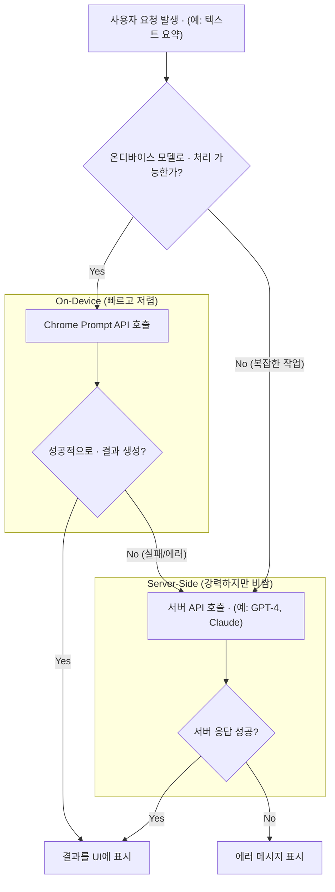

서버 API 호출에 의존하는 AI 기능은 필연적으로 세 가지 문제, 즉 지연 시간(latency), 비용(cost), 그리고 개인정보보호(privacy) 문제를 동반합니다. 사용자가 텍스트를 요약하거나 이메일 초안을 작성할 때마다 데이터를 서버로 보내고 응답을 기다리는 과정은 사용자 경험을 저해하고, API 호출 비용은 서비스 규모에 비례하여 증가합니다. 무엇보다 사용자의 민감한 데이터가 외부 서버로 전송된다는 점은 항상 큰 우려 사항입니다.

Chrome Prompt API는 이러한 문제에 대한 혁신적인 해답을 제시합니다. 브라우저 자체에 내장된 경량 LLM(현재 Gemini Nano)을 웹 개발자가 직접 호출할 수 있도록 설계된 이 API는, AI 연산을 100% 사용자 기기에서 처리합니다. 이는 곧 제로에 가까운 지연 시간, 서버 비용 절감, 그리고 완벽한 데이터 프라이버시를 의미합니다. 프론트엔드 개발자에게 이는 새로운 차원의 AI 기반 사용자 경험을 설계할 수 있는 강력한 도구가 생긴 것과 같습니다.

## Chrome Prompt API의 핵심 매커니즘

Chrome Prompt API의 핵심은 `window.ai` 객체를 통해 브라우저의 AI 엔진과 상호작용하는 것입니다. 개발자는 AI 모델과 추론 세션(inference session)을 생성하고, 프롬프트를 전달하여 스트리밍 방식으로 결과를 받을 수 있습니다.

### 주요 특징
- **온디바이스(On-Device):** 모든 연산이 사용자 기기에서만 이루어집니다. 인터넷 연결이 없어도 동작 가능합니다.
- **프라이버시 우선(Privacy-First):** 데이터가 브라우저 밖으로 나가지 않아 사용자 개인정보를 완벽하게 보호합니다.
- **낮은 지연 시간(Low Latency):** 네트워크 왕복 시간이 없어 즉각적인 응답이 가능합니다. 실시간 상호작용에 최적화되어 있습니다.
- **비용 효율성(Cost-Effective):** 별도의 서버 API 호출 비용이 발생하지 않습니다.

### 기본 동작 코드 예제 (TypeScript)

다음은 텍스트 요약을 요청하는 기본적인 TypeScript 예제입니다.

```typescript
async function summarizeText(textToSummarize: string): Promise<string> {
  // 1. window.ai 객체의 존재 여부 및 모델 가용성 확인
  if (!window.ai || !(await window.ai.canCreateTextSession())) {
    console.error("On-device AI is not available.");
    return "요약 기능을 사용할 수 없습니다.";
  }

  try {
    // 2. 텍스트 세션 생성
    const session = await window.ai.createTextSession();

    // 3. 프롬프트와 함께 스트리밍 응답 요청
    // stream.tee()를 사용해 두 개의 스트림으로 분리: 하나는 전체 응답, 다른 하나는 콘솔 로깅용
    const stream = session.promptStreaming(`다음 텍스트를 한 문장으로 요약해줘: "${textToSummarize}"`);

    const [logStream, resultStream] = stream.tee();
    
    // 개발자 확인을 위해 콘솔에 실시간 출력
    for await (const chunk of logStream) {
      console.log(chunk);
    }
    
    // 4. 전체 응답을 합쳐서 반환
    const fullResponse = await new Response(resultStream).text();

    // 5. 세션 리소스 정리
    session.destroy();

    return fullResponse;

  } catch (error) {
    console.error("Error during text summarization:", error);
    return "요약 중 오류가 발생했습니다.";
  }
}

// 사용 예시
const article = "Chrome Prompt API는 개발자가 브라우저에 내장된 AI 모델을 활용할 수 있게 해주는 새로운 기술입니다. 이를 통해 개인정보를 보호하면서도 빠르고 비용 효율적인 AI 기능을 웹 애플리케이션에 통합할 수 있습니다.";
summarizeText(article).then(summary => {
  console.log("요약 결과:", summary); 
  // 예상 출력: "요약 결과: Chrome Prompt API는 개발자가 브라우저 내장 AI를 사용해 빠르고 안전한 AI 기능을 웹에 적용할 수 있는 기술입니다."
});
```

## 실무 적용 패턴: 점진적 AI 강화 (Progressive AI Enhancement)

모든 작업을 온디바이스 LLM으로 처리할 수는 없습니다. 복잡한 추론이나 방대한 지식이 필요한 작업은 여전히 강력한 서버 사이드 모델(예: GPT-4, Claude 3 Opus)이 더 적합합니다. 따라서 실무에서는 온디바이스 AI와 서버 AI를 결합한 하이브리드 접근 방식이 매우 효과적입니다. 이를 '점진적 AI 강화' 패턴이라 부를 수 있습니다.

이 패턴은 간단한 요청은 온디바이스 모델로 빠르게 처리하여 사용자 경험과 비용 효율을 극대화하고, 온디바이스 모델의 역량을 초과하거나 실패할 경우에만 서버 모델로 폴백(fallback)하는 전략입니다.



### 이 패턴의 장점
- **최적의 사용자 경험:** 간단한 작업은 즉각적으로 응답합니다.
- **비용 최적화:** 서버 API 호출을 최소화하여 운영 비용을 크게 절감합니다.
- **견고성(Resilience):** 서버 장애나 네트워크 문제 발생 시에도 기본적인 AI 기능은 계속 동작할 수 있습니다.

## 온디바이스 vs. 서버 사이드 AI: 언제 무엇을 쓸까?

| 기준 | 온디바이스 AI (Chrome Prompt API) | 서버 사이드 AI (OpenAI, Anthropic) |
| :--- | :--- | :--- |
| **최적 사용 사례** | 실시간 텍스트 요약/수정, 간단한 초안 작성, 로컬 데이터 기반 질의응답 | 복잡한 문서 분석, 전문 코드 생성, 창의적 콘텐츠 생성, 최신 정보 검색 |
| **지연 시간** | 거의 없음 (ms 단위) | 높음 (수백 ms ~ 수 초) |
| **비용** | 없음 | API 호출 당 비용 발생 |
| **개인정보보호** | 매우 높음 (데이터 외부 전송 없음) | 낮음 (서버로 데이터 전송 필요) |
| **성능/역량** | 경량 모델 수준 (sLLM) | 최첨단 모델 수준 (SOTA LLM) |
| **오프라인 지원** | 가능 | 불가능 |


## 2026년 이후의 전망: 브라우저 AI의 미래

Chrome Prompt API는 브라우저 네이티브 AI의 시작에 불과합니다. 2026년 이후, 우리는 다음과 같은 트렌드를 예상할 수 있습니다.

1.  **모델 특화 및 선택적 로딩:** 브라우저가 요약, 번역, 코드 생성 등 특정 작업에 최적화된 여러 소형 모델을 내장하고, 개발자가 필요한 모델만 선택적으로 로드하여 사용할 수 있게 될 것입니다.
2.  **멀티모달(Multi-modal) 지원:** 텍스트뿐만 아니라 이미지, 오디오를 입력으로 받는 API로 확장되어, 웹캠으로 촬영한 이미지를 즉시 분석하거나 음성 명령을 처리하는 기능이 브라우저 네이티브로 구현될 것입니다.
3.  **에이전트(Agent) 기능 내장:** 단순한 프롬프트-응답을 넘어, 여러 단계를 포함하는 작업을 자율적으로 수행하는 브라우저 기반 AI 에이전트를 생성하고 제어하는 API가 등장할 것입니다. 예를 들어, "이 페이지의 핵심 내용을 요약해서 내 노션 페이지에 저장해줘"와 같은 복합적인 명령을 브라우저가 직접 처리하게 됩니다.

Chrome Prompt API의 등장은 프론트엔드 개발의 패러다임을 바꾸고 있습니다. 서버에 대한 의존도를 줄이고 사용자 기기의 컴퓨팅 파워를 적극적으로 활용함으로써, 우리는 더 빠르고, 안전하며, 개인화된 차세대 웹 애플리케이션을 만들어 나갈 수 있을 것입니다.

## 자기 점검

### 이해도 확인 질문
1.  서버 사이드 LLM API와 비교했을 때 Chrome Prompt API가 가지는 세 가지 주요 장점은 무엇인가요?
2.  `window.ai.createTextSession()` 메서드의 역할은 무엇이며, 사용 후 `session.destroy()`를 호출하는 이유는 무엇인가요?
3.  '점진적 AI 강화(Progressive AI Enhancement)' 패턴은 어떤 상황에서 유용하며, 이 패턴을 적용했을 때의 기술적, 사업적 이점은 무엇일까요?

### 동료에게 설명하기
"이 개념을 동료에게 설명한다면?" 형식의 질문:
"방금 입사한 주니어 프론트엔드 개발자에게 '점진적 AI 강화' 패턴을 설명해야 합니다. 온디바이스 AI와 서버 AI를 함께 사용하는 이유와 그 장점을 기술적인 용어를 최소화하여 어떻게 설명하시겠어요? (예: 고속도로와 국도 비유)"

### 실습 과제
간단한 웹 노트 앱을 만든다고 가정하고, 다음 기능을 구현해보세요.
사용자가 `<textarea>`에 노트를 작성하면, '톤 바꾸기' 버튼 그룹('전문적으로', '친근하게', '간결하게')을 제공합니다. 각 버튼을 클릭하면 Chrome Prompt API를 사용하여 현재 텍스트의 톤을 해당 스타일로 변경하여 원본 텍스트를 교체하는 기능을 구현하세요. 브라우저에서 Prompt API를 지원하지 않을 경우, 사용자에게 "이 기능은 최신 버전의 Chrome 브라우저에서만 지원됩니다."라는 메시지를 표시하는 폴백 로직도 추가하세요.