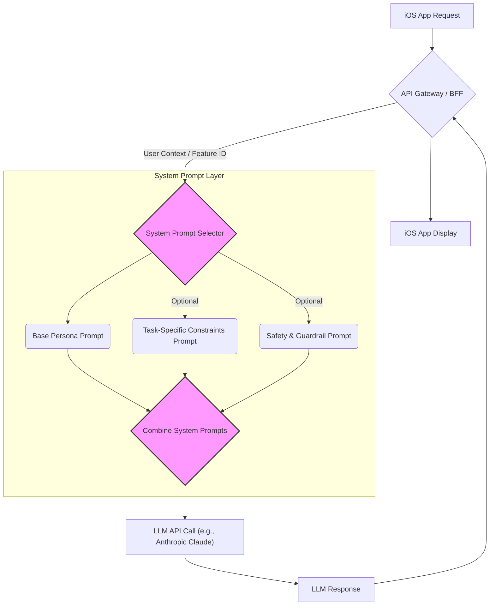

## LLM 동작 제어의 핵심, 시스템 프롬프트

LLM(Large Language Model)을 활용하여 사용자에게 예측 가능하고 신뢰할 수 있는 AI 경험을 제공하는 것은 iOS/프론트엔드 개발자에게 중요한 과제입니다. 사용자가 직접 조작하는 인터페이스를 통해 AI와 상호작용할 때, AI의 일관되지 않은 응답이나 의도치 않은 행동은 전체 애플리케이션의 신뢰도를 떨어뜨릴 수 있습니다. 여기서 '시스템 프롬프트(System Prompt)'의 역할은 매우 중요합니다.

시스템 프롬프트는 LLM에 부여되는 최상위 지시문으로, 모델이 어떤 역할을 수행하고, 어떤 제약조건을 따르며, 어떤 응답 스타일을 유지해야 하는지를 정의합니다. 이는 LLM이 사용자 입력(User Prompt)을 해석하고 응답을 생성하는 과정의 '컨텍스트'이자 '가이드라인' 역할을 합니다. 마치 소프트웨어 아키텍처에서 핵심 비즈니스 로직을 감싸는 서비스 레이어처럼, 시스템 프롬프트는 LLM의 행동을 감싸고 제어하는 최상위 레이어라고 할 수 있습니다.

Anthropic의 Claude Opus 모델이 4.6에서 4.7로 업데이트되면서 시스템 프롬프트의 내부 처리 방식과 강조점이 변화한 것은, LLM 개발 커뮤니티가 모델의 '제어 가능성(Controllability)'을 얼마나 중요하게 여기는지를 보여주는 대표적인 사례입니다. 이러한 변화는 단순히 프롬프트 작성 기술을 넘어, LLM의 근본적인 동작 방식과 개발자의 모델 제어 전략에 깊은 통찰을 제공합니다.

## Claude Opus 시스템 프롬프트 변경 분석 및 시사점

Claude Opus 4.6과 4.7 사이의 시스템 프롬프트 변경 사항은 주로 모델의 '지시 따르기 능력(Instruction Following)'과 '안전성(Safety)' 강화에 초점을 맞추고 있습니다. 구체적인 변경 내역이 모두 공개된 것은 아니지만, 관찰된 동작 변화를 통해 다음과 같은 시사점을 도출할 수 있습니다.

1.  **명확하고 구체적인 지시의 중요성 증대:** 4.7 버전은 모호하거나 추상적인 지시보다는 명확하고 상세한 지시에 더 잘 반응하는 경향을 보입니다. 이는 개발자가 LLM에게 원하는 행동을 더욱 정밀하게 "명령"할 수 있게 되었음을 의미합니다.
2.  **페르소나 및 역할 부여의 강화:** LLM에게 특정 페르소나(예: 친절한 고객 상담사, 엄격한 코드 리뷰어)를 부여하는 시스템 프롬프트가 더욱 강력하게 작동합니다. 이는 사용자 경험(UX) 측면에서 AI의 일관된 성격과 응답 톤을 유지하는 데 결정적인 역할을 합니다.
3.  **내재된 안전 가이드라인의 강화:** 유해하거나 부적절한 콘텐츠 생성에 대한 내부적인 방어 메커니즘이 시스템 프롬프트를 통해 더욱 견고하게 작동하는 것으로 추정됩니다. 개발자는 시스템 프롬프트에 추가적인 안전 지침을 명시함으로써 이 메커니즘을 보강할 수 있습니다.
4.  **제약조건(Constraints) 준수 능력 향상:** 특정 형식(예: JSON, XML)이나 길이, 내용 제한과 같은 제약조건을 시스템 프롬프트에 명시했을 때, LLM이 이를 더 정확하게 따르는 경향이 있습니다. 이는 구조화된 데이터를 다루거나, UI에 직접 표시할 콘텐츠를 생성할 때 매우 유용합니다.

이러한 변화는 LLM이 단순한 텍스트 생성 도구를 넘어, 애플리케이션 내에서 특정 목적을 가진 '모듈'로서 작동하도록 제어하는 데 필요한 기반을 제공합니다.

## 실무에서 LLM 제어 전략: iOS/프론트엔드 관점

iOS/프론트엔드 개발자는 LLM을 직접 다루기보다는 주로 백엔드 API를 통해 LLM과 상호작용합니다. 따라서 LLM 제어 전략은 백엔드 팀과의 협업, 그리고 클라이언트-서버 간의 API 설계 관점에서 접근해야 합니다.

### 1. API 레이어 설계: 시스템 프롬프트의 캡슐화

LLM을 사용하는 API는 단순히 사용자 프롬프트를 전달하는 것을 넘어, 비즈니스 로직에 맞는 시스템 프롬프트를 포함하여 LLM을 호출해야 합니다.

```typescript
// TypeScript (Node.js 기반 BFF - Backend For Frontend) 예시
// 이 코드는 클라이언트(iOS/프론트엔드)로부터 요청을 받아 LLM API를 호출하는 BFF의 한 부분입니다.

import Anthropic from "@anthropic-ai/sdk";
import { Request, Response } from 'express';

const anthropic = new Anthropic({
  apiKey: process.env.ANTHROPIC_API_KEY,
});

// 상품 추천 챗봇을 위한 시스템 프롬프트
const PRODUCT_RECOMMENDER_SYSTEM_PROMPT = `
당신은 고급 전자상거래 웹사이트의 친절하고 유능한 상품 추천 AI입니다.
사용자의 질문에 기반하여 최적의 상품을 제안하고, 필요하다면 추가 질문을 통해 사용자의 취향을 파악해야 합니다.
다음 규칙을 엄격히 준수하세요:
1. 항상 긍정적이고 도움을 주려는 태도를 유지합니다.
2. 사용자에게 한 번에 3개 이상의 상품을 추천하지 않습니다.
3. 추천하는 상품은 항상 가상의 상품 ID와 이름, 간략한 설명을 포함해야 합니다. (예: "상품ID: P123, 이름: '스마트 워치X', 설명: '혁신적인 건강 추적 기능과 세련된 디자인.'")
4. 추천할 상품이 명확하지 않을 경우, 사용자의 예산이나 선호하는 색상, 브랜드 등에 대해 추가 질문을 할 수 있습니다.
5. 절대 고객의 개인 정보를 요구하거나 추론하지 않습니다.
6. 응답은 항상 한국어로 작성합니다.
7. 답변 마지막에는 항상 "더 궁금한 점이 있으시면 언제든지 문의해 주세요!" 문구를 추가합니다.
`;

export async function handleProductRecommendation(req: Request, res: Response) {
  const userQuery = req.body.query;

  if (!userQuery) {
    return res.status(400).json({ error: "Query parameter is required." });
  }

  try {
    const response = await anthropic.messages.create({
      model: "claude-3-opus-20240229", // 또는 최신 Opus 모델 ID
      max_tokens: 1024,
      system: PRODUCT_RECOMMENDER_SYSTEM_PROMPT, // 핵심: 시스템 프롬프트 주입
      messages: [
        { role: "user", content: userQuery }
      ],
    });

    // LLM 응답 파싱 및 클라이언트에 전달
    const llmResponse = response.content.map(block => block.text).join('');
    res.json({ recommendation: llmResponse });

  } catch (error) {
    console.error("Error calling Anthropic API:", error);
    res.status(500).json({ error: "Failed to get recommendation from AI." });
  }
}
```

위 TypeScript 예시처럼, 백엔드에서 `PRODUCT_RECOMMENDER_SYSTEM_PROMPT`와 같이 상세하게 정의된 시스템 프롬프트를 LLM 호출 시 함께 전달합니다. iOS/프론트엔드 앱은 이 API를 호출함으로써, LLM의 내부 동작은 몰라도 항상 일관된 페르소나와 규칙을 따르는 AI 응답을 받을 수 있습니다.

### 2. 사용자 경험(UX) 일관성 확보

시스템 프롬프트는 AI의 페르소나와 응답 톤을 정의하여 사용자 경험의 일관성을 보장합니다.

*   **동일한 AI 어시스턴트:** 앱의 여러 부분에서 AI 기능을 사용하더라도, 시스템 프롬프트를 통해 항상 동일한 '성격'을 가진 AI와 대화하는 것처럼 느끼게 할 수 있습니다.
*   **예측 가능한 인터페이스:** AI가 특정 형식의 데이터를 반환해야 할 때, 시스템 프롬프트에 해당 형식을 명시함으로써 프론트엔드에서 파싱 오류를 줄이고 안정적인 UI 렌더링을 가능하게 합니다.

### 3. 동적 시스템 프롬프트 및 모듈화

단일 시스템 프롬프트로 모든 시나리오를 커버하기는 어렵습니다. 앱의 특정 기능이나 사용자 컨텍스트에 따라 시스템 프롬프트를 동적으로 변경하거나, 여러 시스템 프롬프트 조각을 조합하는 '모듈화' 전략을 고려할 수 있습니다.



위 다이어그램은 iOS 앱에서 AI 기능을 요청했을 때, 백엔드(BFF)에서 사용자 컨텍스트나 기능 ID에 따라 여러 시스템 프롬프트 조각(기본 페르소나, 작업별 제약조건, 안전 가이드라인)을 조합하여 LLM에 전달하는 과정을 보여줍니다. 이는 LLM의 유연성을 높이면서도 각 기능의 요구사항을 정확히 충족시키는 방법입니다.

### 4. LLM 응답 품질 가드 패턴 보강

시스템 프롬프트만으로 LLM의 모든 행동을 완벽하게 제어하기는 어렵습니다. 때로는 LLM이 제약조건을 위반하거나 예상치 못한 응답을 할 수 있습니다. 이를 대비하여 클라이언트 또는 BFF 단에서 'LLM 응답 품질 가드 패턴'을 적용하여 안전 장치를 마련해야 합니다.

| 가드 패턴             | 설명                                                                   | iOS/프론트엔드 적용                                         |
| :------------------ | :--------------------------------------------------------------------- | :---------------------------------------------------------- |
| **Retry with Refinement** | 응답이 조건에 맞지 않을 경우, 수정 지시와 함께 재요청                      | 재시도 버튼 제공, 또는 백그라운드에서 자동 재시도 로직 구현 |
| **Fallback to Default**   | 응답 파싱 실패 시, 미리 정의된 기본값 또는 에러 메시지 표시              | 사용자에게 "죄송합니다, 잠시 후 다시 시도해 주세요." 메시지 |
| **Response Validation**   | 응답의 JSON 스키마, 길이, 내용 등을 코드 레벨에서 검증                   | `JSONDecoder` (Swift), `Zod` (TypeScript) 등으로 유효성 검사 |
| **Human in the Loop**     | 중요하거나 복잡한 작업은 AI 응답 후 사용자 또는 관리자의 확인 절차 추가 | AI 제안을 사용자가 수락/거부하는 UI 패턴 구현               |

시스템 프롬프트는 LLM의 기본 동작을 가이드하지만, 클라이언트 측의 유효성 검사 및 사용자 피드백 메커니즘은 AI 시스템의 견고함을 완성하는 필수적인 요소입니다.

## 2026년 최신 트렌드 반영: "System Prompt as Code"

2026년에는 LLM의 '시스템 프롬프트'가 단순한 텍스트를 넘어, 애플리케이션의 핵심 로직을 정의하는 '코드'의 일부로 인식되는 트렌드가 가속화될 것입니다. 이를 **"System Prompt as Code"** 패러다임이라고 부를 수 있습니다.

*   **버전 관리 및 코드 리뷰:** 시스템 프롬프트는 Git과 같은 버전 관리 시스템으로 관리되며, 코드와 마찬가지로 리뷰 프로세스를 거쳐 변경 사항이 추적됩니다.
*   **테스트 주도 개발(TDD) 적용:** 특정 시스템 프롬프트가 주어졌을 때, LLM이 예상하는 출력을 생성하는지 확인하는 테스트 케이스를 작성합니다. 이는 LLM 통합의 신뢰성을 획기적으로 높입니다.
*   **선언적 AI 행동 정의:** YAML, JSON, 또는 특정 DSL(Domain Specific Language)을 사용하여 시스템 프롬프트의 논리적 구조와 제약조건을 선언적으로 정의하는 방식이 보편화될 것입니다. 이를 통해 개발자는 자연어로 된 지시를 작성하는 것 이상으로 LLM의 행동을 명확히 제어할 수 있습니다.
*   **자동화된 프롬프트 최적화:** A/B 테스트, 강화 학습(Reinforcement Learning) 등을 통해 특정 목표(예: 사용자 만족도, 비용 효율성)를 달성하기 위한 최적의 시스템 프롬프트를 자동으로 탐색하고 배포하는 시스템이 보편화될 것입니다.

이러한 트렌드는 LLM을 활용한 AI 기능을 개발할 때, 개발자들이 시스템 프롬프트를 더 이상 부수적인 요소가 아닌, 핵심적인 '설계 도구'이자 '코드'로 인식하게 만들 것입니다.

## 자기 점검

1.  시스템 프롬프트의 주된 역할은 무엇이며, LLM 기반 애플리케이션 개발에서 왜 중요한가요?
2.  Claude Opus 4.6에서 4.7로의 시스템 프롬프트 변경이 시사하는 바를 3가지 이상 설명해 보세요.
3.  iOS/프론트엔드 개발자가 LLM API를 활용하여 AI 기능을 구현할 때, 시스템 프롬프트 제어 관점에서 API 레이어를 어떻게 설계하는 것이 바람직할까요? 코드 예시에서 `PRODUCT_RECOMMENDER_SYSTEM_PROMPT`가 어떤 역할을 하는지 설명해 보세요.
4.  "System Prompt as Code" 패러다임이 의미하는 바는 무엇이며, 2026년 LLM 개발 트렌드에서 어떤 영향을 미칠 것으로 예상되나요?
5.  시스템 프롬프트만으로 LLM의 모든 행동을 제어하기 어렵다면, LLM 응답 품질을 확보하기 위한 추가적인 가드 패턴에는 어떤 것들이 있나요?

이 개념을 동료 iOS 개발자에게 설명한다면, Claude Opus의 시스템 프롬프트 변화가 우리 앱의 AI 기능 개발에 어떤 의미를 가지는지 어떤 점을 가장 강조하시겠습니까?

실습 과제: 현재 개발 중인 iOS/프론트엔드 프로젝트에서 AI 기능을 통합할 계획이라면, 특정 기능(예: 고객 지원 챗봇, 콘텐츠 요약)을 위해 Claude Opus 스타일의 상세하고 명확한 시스템 프롬프트를 작성해보고, 예상되는 이점을 3가지 이상 명시해 보세요.