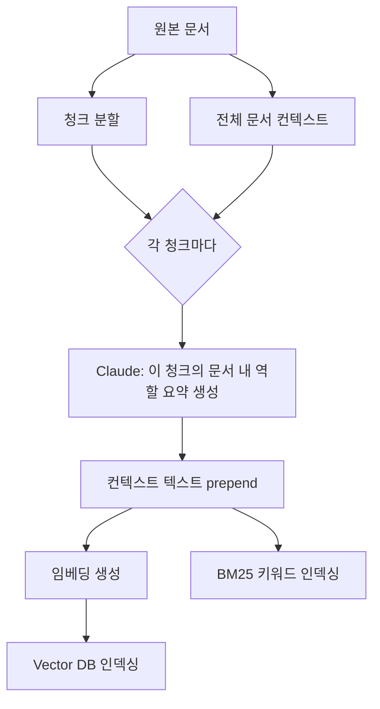

## 왜 RAG는 여전히 틀리는가

RAG의 고전적인 실패 패턴은 이렇다. 문서를 500토큰씩 자르고, 각 청크를 임베딩해서 벡터 DB에 저장한다. 질문이 오면 유사한 청크를 가져와서 LLM에 던진다.

문제는 **청크가 원본 문서에서 분리되는 순간 맥락을 잃는다**는 것이다.

예를 들어, 회사 재무 보고서를 청킹했을 때 이런 청크가 만들어진다고 하자:

> "The revenue growth was 12% compared to the previous quarter."

이 청크만 봐서는 무슨 회사인지, 몇 년 몇 분기인지, 어떤 사업부인지 전혀 알 수 없다. 벡터 임베딩 역시 이 맥락 없는 텍스트를 기반으로 만들어진다. 사용자가 "2023년 3분기 소비자 부문 매출"을 물으면, 이 청크는 낮은 유사도 점수를 받거나 아예 검색에서 누락된다.

Anthropic이 2024년 9월 공개한 **Contextual Retrieval**은 이 문제를 인덱싱 단계에서 해결한다.

## 핵심 메커니즘



### Step 1: 청크마다 컨텍스트 생성

각 청크를 인덱싱하기 전에, 원본 문서 전체와 해당 청크를 Claude에 넘겨서 짧은 컨텍스트 설명을 생성한다.

```python
CONTEXTUAL_PROMPT = """
<document>
{full_document}
</document>

위 문서에서 아래 청크가 어떤 맥락에 속하는지 2-3문장으로 설명하세요.
이 설명은 검색 인덱스에 사용되므로, 핵심 식별자(날짜, 조직명, 주제)를 반드시 포함하세요.
설명 외 다른 내용은 출력하지 마세요.

<chunk>
{chunk_content}
</chunk>
"""

def generate_chunk_context(full_doc: str, chunk: str, client) -> str:
    response = client.messages.create(
        model="claude-haiku-4-5-20251001",  # 빠르고 저렴한 모델 사용
        max_tokens=200,
        messages=[{
            "role": "user",
            "content": CONTEXTUAL_PROMPT.format(
                full_document=full_doc,
                chunk_content=chunk
            )
        }]
    )
    return response.content[0].text
```

위 청크 예시에 적용하면 Claude는 이런 컨텍스트를 생성한다:

> "이 청크는 ABC Corp의 2023년 3분기 연간 보고서 소비자 부문 섹션에서, 전분기 대비 매출 성장률을 서술하는 내용이다."

### Step 2: 컨텍스트를 청크에 prepend

```python
def create_contextual_chunk(context: str, chunk: str) -> str:
    return f"{context}\n\n{chunk}"

# 이 텍스트를 임베딩하고 BM25에도 인덱싱
contextual_chunk = create_contextual_chunk(context, original_chunk)
```

이제 임베딩은 맥락이 풍부한 텍스트를 기반으로 만들어진다. 검색 정확도가 올라간다.

## Prompt Caching으로 비용 90% 절감

청크가 10,000개라면 LLM 호출도 10,000번이다. 그런데 각 호출마다 전체 문서(`full_document`)가 반복된다. Anthropic의 **Prompt Caching**을 쓰면 문서 부분을 캐시할 수 있다.

```python
import anthropic

client = anthropic.Anthropic()

def generate_context_with_caching(full_doc: str, chunks: list[str]) -> list[str]:
    contexts = []
    
    for chunk in chunks:
        response = client.messages.create(
            model="claude-haiku-4-5-20251001",
            max_tokens=200,
            system=[{
                "type": "text",
                "text": "당신은 문서 청크에 대한 맥락 설명을 생성하는 전문가입니다.",
                "cache_control": {"type": "ephemeral"}  # 시스템 프롬프트 캐시
            }],
            messages=[{
                "role": "user",
                "content": [
                    {
                        "type": "text",
                        "text": f"<document>\n{full_doc}\n</document>",
                        "cache_control": {"type": "ephemeral"}  # 전체 문서 캐시 ← 핵심
                    },
                    {
                        "type": "text",
                        "text": f"위 문서에서 아래 청크의 맥락을 2-3문장으로 설명하세요.\n\n<chunk>\n{chunk}\n</chunk>"
                    }
                ]
            }]
        )
        contexts.append(response.content[0].text)
    
    return contexts
```

같은 문서의 청크들을 연속으로 처리할 때, `full_document` 부분은 캐시 히트가 된다. 문서당 첫 번째 청크만 전체 토큰 비용을 내고, 나머지는 캐시 읽기 비용(입력 토큰의 10%)만 낸다.

**실제 비용 절감**: 1000페이지 문서를 50개 청크로 나눴다면, 첫 청크에서만 전체 문서 토큰을 소비하고 나머지 49개는 90% 할인된 가격으로 처리된다.

## BM25 하이브리드 검색 추가

Contextual Retrieval의 효과를 극대화하려면 **벡터 검색 + BM25 키워드 검색**을 조합한다.

```python
from rank_bm25 import BM25Okapi
import numpy as np

class HybridRetriever:
    def __init__(self, contextual_chunks: list[str], embeddings: list[list[float]]):
        # BM25 인덱스
        tokenized = [chunk.split() for chunk in contextual_chunks]
        self.bm25 = BM25Okapi(tokenized)
        
        # 벡터 검색용 임베딩
        self.embeddings = np.array(embeddings)
        self.chunks = contextual_chunks
    
    def retrieve(self, query: str, query_embedding: list[float], top_k: int = 20) -> list[str]:
        # BM25 점수
        bm25_scores = self.bm25.get_scores(query.split())
        bm25_normalized = bm25_scores / (bm25_scores.max() + 1e-8)
        
        # 벡터 유사도 점수
        q_emb = np.array(query_embedding)
        cosine_scores = self.embeddings @ q_emb / (
            np.linalg.norm(self.embeddings, axis=1) * np.linalg.norm(q_emb) + 1e-8
        )
        
        # RRF (Reciprocal Rank Fusion) 조합
        combined = 0.5 * bm25_normalized + 0.5 * cosine_scores
        top_indices = np.argsort(combined)[::-1][:top_k]
        
        return [self.chunks[i] for i in top_indices]
```

BM25는 벡터 임베딩이 놓치는 **정확한 키워드 매칭**을 잡아낸다. 제품 코드, 고유명사, 전문 용어 검색에 특히 강하다.

## 성능 지표 (Anthropic 보고서 기준)

| 방법 | 검색 실패율 감소 |
|------|----------------|
| 기본 RAG (baseline) | 0% |
| Contextual Embeddings | 49% |
| Contextual Embeddings + BM25 | 60% |
| Contextual Embeddings + BM25 + Reranking | 67% |

Reranking은 검색된 Top-20 청크를 cross-encoder 모델로 재정렬해서 최종 Top-5를 뽑는다. Cohere Rerank API나 로컬 `cross-encoder/ms-marco-MiniLM-L-6-v2` 모델을 쓸 수 있다.

## 실전 적용

### 언제 도입해야 하는가

- **도입 필수**: 긴 문서(보고서, 매뉴얼, 법령)에서 청크가 50개 이상인 경우
- **효과 미미**: 청크가 이미 자체 완결적인 경우 (QA 데이터셋, 짧은 FAQ)
- **비용 정당화**: RAG 품질이 비즈니스 지표에 직결될 때 (고객 지원, 법률 검색)

### 도입 순서

1. **기준선 측정**: 현재 RAG의 Recall@5, Recall@10 측정
2. **파일럿 문서 선정**: 가장 실패가 잦은 문서 카테고리 1~2개
3. **컨텍스트 생성**: `claude-haiku`로 배치 처리 (Prompt Caching 필수)
4. **A/B 비교**: 동일 쿼리셋으로 기존 vs Contextual Retrieval 비교
5. **임계점 확인**: 비용 대비 품질 향상이 정당한지 판단 후 전체 적용

### 주의할 함정

**함정 1: 청크 크기를 늘리는 것과 혼동**  
청크를 크게 만들면 맥락이 더 풍부해지지만, 임베딩 품질이 떨어지고 검색 granularity가 줄어든다. Contextual Retrieval은 **청크 크기를 유지하면서** 맥락만 추가한다.

**함정 2: 컨텍스트가 너무 길어지는 경우**  
생성된 컨텍스트는 50~100토큰이 적정하다. 너무 길면 청크 자체의 신호가 희석된다. 프롬프트에 길이 제한을 명시하라.

**함정 3: 재인덱싱 비용 무시**  
문서가 업데이트되면 해당 문서의 모든 청크를 재처리해야 한다. 문서 버전 관리와 인덱싱 파이프라인을 연동해야 한다.

## 이 위키에 적용된 사례

ai-study의 Layer 3 JIT 검색(`public/embeddings.json`)은 현재 기본 임베딩을 사용한다. Contextual Retrieval을 적용하면 "하네스 엔지니어링에서 테스트 실패 처리"처럼 맥락 의존적인 쿼리의 검색 정확도를 높일 수 있다. 특히 `harness-journal-*` 시리즈처럼 동일 주제가 여러 청크로 분산된 경우 효과가 크다.

## 핵심 요약

| 포인트 | 내용 |
|--------|------|
| **무엇을** | 청크 인덱싱 전에 문서 맥락을 prepend |
| **언제** | 인덱싱 파이프라인 (쿼리 타임 아님) |
| **비용 절감** | Prompt Caching으로 문서당 90%+ 절감 |
| **조합** | Contextual + BM25 + Reranking = 67% 실패율 감소 |
| **주의** | 문서 업데이트 시 재인덱싱 파이프라인 필요 |
