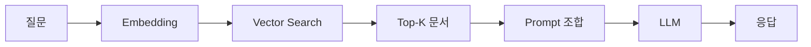

## 핵심 개념

RAG(Retrieval-Augmented Generation)는 LLM이 **외부 지식 소스를 검색하여** 더 정확하고 최신의 응답을 생성하는 아키텍처다. 모델의 파라메트릭 지식에만 의존하지 않고, 실시간으로 관련 문서를 찾아 컨텍스트로 제공한다.

## 기본 파이프라인

### 1. 문서 전처리 (Indexing)
- **Chunking**: 문서를 적절한 크기로 분할 (보통 500-1000 토큰)
- **Embedding**: 각 청크를 벡터로 변환 (text-embedding-3-small 등)
- **저장**: Vector DB에 인덱싱 (Pinecone, Weaviate, Chroma 등)

### 2. 검색 (Retrieval)
- 사용자 질문을 같은 임베딩 모델로 벡터화
- Vector DB에서 코사인 유사도 기반 Top-K 검색
- 선택적으로 Reranker로 재정렬 (Cohere Rerank, cross-encoder)

### 3. 생성 (Generation)
- 검색된 문서를 프롬프트의 컨텍스트로 주입
- LLM이 컨텍스트 기반으로 응답 생성

## Chunking 전략

| 전략 | 설명 | 장점 | 단점 |
|------|------|------|------|
| Fixed size | 고정 토큰 수로 분할 | 간단 | 의미 단위 무시 |
| Recursive | 구분자 기반 재귀 분할 | 의미 보존 | 구현 복잡 |
| Semantic | 임베딩 유사도로 분할 | 최고 품질 | 느림 |

## 평가 메트릭

- **Retrieval**: Hit Rate, MRR, NDCG
- **Generation**: Faithfulness, Relevance, Answer Correctness
- **E2E**: RAGAS 프레임워크

## 알려진 한계

- Chunking이 잘못되면 관련 정보가 분리되어 검색 실패
- 임베딩 모델의 한계 (의미적 유사성 vs 관련성)
- 긴 컨텍스트에서 "Lost in the middle" 문제

## AI Agent Directive

**Trigger**: LLM이 **최신 또는 외부 지식**에 접근해야 할 때. 모델의 학습 데이터에 없는 정보(최신 뉴스, 내부 문서, 실시간 데이터)를 기반으로 응답해야 하는 경우.

**Prerequisites**:
- [rag/vector-search-basics](/wiki/rag/vector-search-basics) — 임베딩과 유사도 검색 기초
- [rag/vector-databases](/wiki/rag/vector-databases) — 벡터 DB 선택 및 구축

### Actionable Steps
1. **문서 전처리(Indexing)**: 외부 지식 소스(문서, 웹페이지, DB 등)를 수집하고 청크로 분할 (보통 500-1000 토큰). 의미 단위를 고려하여 분할 (Fixed-size, Recursive, 또는 Semantic)
2. **임베딩 모델 선택**: 비용/품질 균형. 1000개 미만 문서면 `text-embedding-3-small`, 다국어 지원 필요하면 `multilingual-e5-small`. 벡터 DB에 저장
3. **검색 파이프라인 구현**: 사용자 질문 → 동일한 임베딩 모델로 벡터화 → 코사인 유사도로 Top-K 검색 (K는 보통 5-10)
4. **재순위(Reranking) 옵션**: 검색된 Top-K 중에서 실제로 관련 있는 문서를 다시 정렬 (Cohere Rerank, cross-encoder). 정확도 향상 but 비용 증가
5. **컨텍스트 주입**: 검색된 문서를 프롬프트에 "참고 자료" 또는 "컨텍스트" 섹션으로 명시적 추가
6. **Hallucination 방지**: LLM에게 "검색된 문서에만 기반하여 답변하라" 명시. 문서에 없는 내용을 만들지 말 것
7. **평가 및 튜닝**: Retrieval Recall@10 (정답 문서가 상위 10개 안에?), 최종 답변의 정확성 측정. 부족하면 임베딩 모델, chunking 전략, reranker 교체 시도

### Anti-patterns
- 청킹을 무시하고 전체 문서를 벡터화 (의미 손실, 검색 부정확)
- 검색은 하되 프롬프트에 결과를 제대로 주입하지 않기 (LLM이 학습 데이터로 회귀)
- Recall 검증 없이 임베딩 모델 고정 (나쁜 모델에 갇힘)
- 모든 Top-K 결과를 필터 없이 주입 (긴 컨텍스트에서 품질 저하 + "Lost in the middle" 문제)

---
