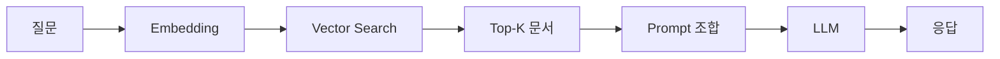

## 핵심 개념

RAG(Retrieval-Augmented Generation)는 LLM이 **외부 지식 소스를 검색하여** 더 정확하고 최신의 응답을 생성하는 아키텍처다. 모델의 파라메트릭 지식에만 의존하지 않고, 실시간으로 관련 문서를 찾아 컨텍스트로 제공한다.

## 기본 파이프라인



### 1. 문서 전처리 (Indexing)
- **Chunking**: 문서를 적절한 크기로 분할 (보통 500-1000 토큰)
- **Embedding**: 각 청크를 벡터로 변환 (text-embedding-3-small 등)
- **저장**: Vector DB에 인덱싱 (Pinecone, Weaviate, Chroma 등)

### 2. 검색 (Retrieval)
- 사용자 질문을 같은 임베딩 모델로 벡터화
- Vector DB에서 코사인 유사도 기반 Top-K 검색
- 선택적으로 Reranker로 재정렬 (Cohere Rerank, cross-encoder)

### 3. 생성 (Generation)
- 검색된 문서를 프롬프트의 컨텍스트로 주입
- LLM이 컨텍스트 기반으로 응답 생성

## Chunking 전략

| 전략 | 설명 | 장점 | 단점 |
|------|------|------|------|
| Fixed size | 고정 토큰 수로 분할 | 간단 | 의미 단위 무시 |
| Recursive | 구분자 기반 재귀 분할 | 의미 보존 | 구현 복잡 |
| Semantic | 임베딩 유사도로 분할 | 최고 품질 | 느림 |

## 실전 RAG 구현 예시

```typescript
import Anthropic from "@anthropic-ai/sdk";
import { CohereClient } from "cohere-ai";

const anthropic = new Anthropic();
const cohere = new CohereClient({ token: process.env.COHERE_API_KEY });

// 1단계: 문서 인덱싱 (오프라인)
interface Document {
  id: string;
  content: string;
  source: string;
}

interface Chunk {
  id: string;
  text: string;
  source: string;
  embedding: number[];
}

// 간단한 Fixed-size chunking (실제로는 RecursiveCharacterTextSplitter 사용 권장)
function chunkDocument(doc: Document, chunkSize = 500): string[] {
  const chunks: string[] = [];
  let current = "";

  const words = doc.content.split(" ");
  for (const word of words) {
    if ((current + " " + word).length > chunkSize) {
      chunks.push(current.trim());
      current = word;
    } else {
      current += (current ? " " : "") + word;
    }
  }
  if (current) chunks.push(current.trim());

  return chunks;
}

// 임베딩 생성 (Cohere Embed API)
async function embedChunks(documents: Document[]): Promise<Chunk[]> {
  const chunks: Chunk[] = [];

  for (const doc of documents) {
    const docChunks = chunkDocument(doc);

    // Cohere로 배치 임베딩
    const result = await cohere.embed({
      texts: docChunks,
      model: "embed-english-v3.0",
      inputType: "search_document",
    });

    for (let i = 0; i < docChunks.length; i++) {
      chunks.push({
        id: `${doc.id}-chunk-${i}`,
        text: docChunks[i],
        source: doc.source,
        embedding: result.embeddings[i],
      });
    }
  }

  return chunks;
}

// 2단계: 검색 (온라인)
async function retrieveRelevantChunks(
  query: string,
  allChunks: Chunk[],
  topK = 5
): Promise<Chunk[]> {
  // 쿼리 임베딩
  const queryResult = await cohere.embed({
    texts: [query],
    model: "embed-english-v3.0",
    inputType: "search_query",
  });
  const queryEmbedding = queryResult.embeddings[0];

  // 코사인 유사도 계산
  function cosineSimilarity(a: number[], b: number[]): number {
    const dotProduct = a.reduce((sum, x, i) => sum + x * b[i], 0);
    const magA = Math.sqrt(a.reduce((sum, x) => sum + x * x, 0));
    const magB = Math.sqrt(b.reduce((sum, x) => sum + x * x, 0));
    return dotProduct / (magA * magB);
  }

  // 모든 청크와의 유사도 계산
  const scored = allChunks.map((chunk) => ({
    chunk,
    score: cosineSimilarity(queryEmbedding, chunk.embedding),
  }));

  // 상위 K개 반환
  return scored
    .sort((a, b) => b.score - a.score)
    .slice(0, topK)
    .map((x) => x.chunk);
}

// 3단계: Reranking (선택)
async function rerank(
  query: string,
  candidates: Chunk[],
  topN = 3
): Promise<Chunk[]> {
  const result = await cohere.rerank({
    model: "rerank-english-v3.0",
    query: query,
    documents: candidates.map((c) => ({ text: c.text })),
    topN: topN,
  });

  return result.results.map((r) => candidates[r.index]);
}

// 4단계: 생성
async function generateWithRAG(
  query: string,
  relevantChunks: Chunk[]
): Promise<string> {
  const context = relevantChunks.map((c) => `[${c.source}]\n${c.text}`).join("\n\n");

  const message = await anthropic.messages.create({
    model: "claude-opus-4-20250805",
    max_tokens: 1024,
    messages: [
      {
        role: "user",
        content: `다음 컨텍스트를 기반으로 질문에 답하세요. 컨텍스트에 없는 정보는 만들지 마세요.

[컨텍스트]
${context}

[질문]
${query}`,
      },
    ],
  });

  return message.content[0].type === "text" ? message.content[0].text : "";
}

// 통합 RAG 파이프라인
async function rag(query: string, documents: Document[]): Promise<string> {
  // 1. 오프라인 인덱싱
  console.log("Indexing documents...");
  const chunks = await embedChunks(documents);

  // 2. 온라인 검색
  console.log("Retrieving relevant chunks...");
  let retrieved = await retrieveRelevantChunks(query, chunks, 10);

  // 3. Reranking (선택)
  console.log("Reranking...");
  retrieved = await rerank(query, retrieved, 3);

  // 4. 생성
  console.log("Generating response...");
  const response = await generateWithRAG(query, retrieved);

  return response;
}

// 사용 예시
const documents: Document[] = [
  {
    id: "doc1",
    source: "company-handbook.pdf",
    content: "회사 복지 정책: 유연근무 가능, 재택근무 주 2회, 건강보험 100% 지원...",
  },
  {
    id: "doc2",
    source: "product-manual.pdf",
    content: "제품 매뉴얼: TypeScript API 문서. 주요 기능은 타입 안전성...",
  },
];

rag("우리 회사의 유연근무 정책은?", documents).then((response) => {
  console.log("Response:", response);
});
```

## 평가 메트릭

- **Retrieval**: Hit Rate, MRR, NDCG
- **Generation**: Faithfulness, Relevance, Answer Correctness
- **E2E**: RAGAS 프레임워크

## 알려진 한계

- Chunking이 잘못되면 관련 정보가 분리되어 검색 실패
- 임베딩 모델의 한계 (의미적 유사성 vs 관련성)
- 긴 컨텍스트에서 "Lost in the middle" 문제

## AI Agent Directive

**Trigger**: LLM이 **최신 또는 외부 지식**에 접근해야 할 때. 모델의 학습 데이터에 없는 정보(최신 뉴스, 내부 문서, 실시간 데이터)를 기반으로 응답해야 하는 경우.

**Prerequisites**:
- [rag/vector-search-basics](/wiki/rag/vector-search-basics) — 임베딩과 유사도 검색 기초
- [rag/vector-databases](/wiki/rag/vector-databases) — 벡터 DB 선택 및 구축

### Actionable Steps
1. **문서 전처리(Indexing)**: 외부 지식 소스(문서, 웹페이지, DB 등)를 수집하고 청크로 분할 (보통 500-1000 토큰). 의미 단위를 고려하여 분할 (Fixed-size, Recursive, 또는 Semantic)
2. **임베딩 모델 선택**: 비용/품질 균형. 1000개 미만 문서면 `text-embedding-3-small`, 다국어 지원 필요하면 `multilingual-e5-small`. 벡터 DB에 저장
3. **검색 파이프라인 구현**: 사용자 질문 → 동일한 임베딩 모델로 벡터화 → 코사인 유사도로 Top-K 검색 (K는 보통 5-10)
4. **재순위(Reranking) 옵션**: 검색된 Top-K 중에서 실제로 관련 있는 문서를 다시 정렬 (Cohere Rerank, cross-encoder). 정확도 향상 but 비용 증가
5. **컨텍스트 주입**: 검색된 문서를 프롬프트에 "참고 자료" 또는 "컨텍스트" 섹션으로 명시적 추가
6. **Hallucination 방지**: LLM에게 "검색된 문서에만 기반하여 답변하라" 명시. 문서에 없는 내용을 만들지 말 것
7. **평가 및 튜닝**: Retrieval Recall@10 (정답 문서가 상위 10개 안에?), 최종 답변의 정확성 측정. 부족하면 임베딩 모델, chunking 전략, reranker 교체 시도

### Anti-patterns
- 청킹을 무시하고 전체 문서를 벡터화 (의미 손실, 검색 부정확)
- 검색은 하되 프롬프트에 결과를 제대로 주입하지 않기 (LLM이 학습 데이터로 회귀)
- Recall 검증 없이 임베딩 모델 고정 (나쁜 모델에 갇힘)
- 모든 Top-K 결과를 필터 없이 주입 (긴 컨텍스트에서 품질 저하 + "Lost in the middle" 문제)

---
