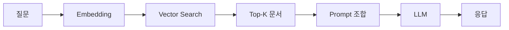

## 핵심 개념

RAG(Retrieval-Augmented Generation)는 LLM이 **외부 지식 소스를 검색하여** 더 정확하고 최신의 응답을 생성하는 아키텍처다. 모델의 파라메트릭 지식에만 의존하지 않고, 실시간으로 관련 문서를 찾아 컨텍스트로 제공한다.

## 기본 파이프라인

### 1. 문서 전처리 (Indexing)
- **Chunking**: 문서를 적절한 크기로 분할 (보통 500-1000 토큰)
- **Embedding**: 각 청크를 벡터로 변환 (text-embedding-3-small 등)
- **저장**: Vector DB에 인덱싱 (Pinecone, Weaviate, Chroma 등)

### 2. 검색 (Retrieval)
- 사용자 질문을 같은 임베딩 모델로 벡터화
- Vector DB에서 코사인 유사도 기반 Top-K 검색
- 선택적으로 Reranker로 재정렬 (Cohere Rerank, cross-encoder)

### 3. 생성 (Generation)
- 검색된 문서를 프롬프트의 컨텍스트로 주입
- LLM이 컨텍스트 기반으로 응답 생성

## Chunking 전략

| 전략 | 설명 | 장점 | 단점 |
|------|------|------|------|
| Fixed size | 고정 토큰 수로 분할 | 간단 | 의미 단위 무시 |
| Recursive | 구분자 기반 재귀 분할 | 의미 보존 | 구현 복잡 |
| Semantic | 임베딩 유사도로 분할 | 최고 품질 | 느림 |

## 평가 메트릭

- **Retrieval**: Hit Rate, MRR, NDCG
- **Generation**: Faithfulness, Relevance, Answer Correctness
- **E2E**: RAGAS 프레임워크

## 알려진 한계

- Chunking이 잘못되면 관련 정보가 분리되어 검색 실패
- 임베딩 모델의 한계 (의미적 유사성 vs 관련성)
- 긴 컨텍스트에서 "Lost in the middle" 문제
