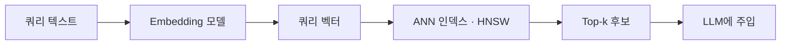

## 한 줄 요약

RAG의 retrieval 단계는 "질문과 의미가 가까운 문서"를 찾는 문제다.
텍스트를 **벡터로 임베딩**하고, **코사인 유사도**로 거리를 재고, 정확한 k-NN이 비싸니까 **ANN 인덱스(HNSW)** 로 근사 검색한다.
이 스텁은 그 흐름의 지도(map)다 — 깊이보다 *어디서 시작해야 할지*에 초점.

---

## 1. 벡터 임베딩이란

임베딩 모델은 텍스트 → 고차원 실수 벡터(보통 768 / 1536 / 3072 차원)로 매핑한다.
잘 학습된 모델이면 **의미가 가까운 텍스트는 공간 상에서도 가까운 점**이 된다.

```python
# pseudocode
q = embed("고양이가 소파에 있다")          # shape (1536,)
d = embed("냐옹이가 거실 쿠션에 누워 있음")  # shape (1536,)
# cos_sim(q, d) ≈ 0.87  → 거의 같은 의미
```

핵심은 "텍스트의 의미를 벡터 공간의 위치로 바꾸는 것". 이후 모든 검색은 **벡터 연산**이 된다.

---

## 2. 유사도 측정 — 왜 코사인인가

가장 자주 쓰이는 측정:

- **코사인 유사도**: `cos(θ) = (a · b) / (‖a‖‖b‖)` — 두 벡터의 *방향* 비교
- **유클리드 거리**: `‖a − b‖` — 두 점 사이의 직선 거리
- **내적(dot product)**: 벡터를 L2 정규화하면 코사인과 동일

임베딩 공간에서는 **방향이 의미**를 담는다 (크기는 문서 길이 등 부가 정보에 오염되기 쉽다). 그래서 코사인이 표준이다. 대부분의 임베딩 모델은 L2 정규화된 출력을 내도록 학습되어, 실무에서는 그냥 내적으로 계산한다.

---

## 3. k-NN → ANN

Naive k-NN은 쿼리 벡터를 코퍼스의 모든 벡터와 비교한다 → **O(N × D)**. 100만 문서 × 1536차원이면 한 질의에 수십억 곱셈. 비현실적이다.

대신 **ANN (Approximate Nearest Neighbor)** 을 쓴다. 정확도를 조금 포기하고 sub-linear 시간(보통 O(log N) 수준)에 *충분히 좋은* 후보 k개를 찾는다. RAG 품질은 recall이 95%든 99%든 최종 답변에 거의 차이가 없으니 합리적 트레이드.



---

## 4. ANN 알고리즘 — HNSW / IVF / LSH

- **HNSW** (Hierarchical Navigable Small World): 다층 그래프 + greedy 탐색. 메모리를 쓰지만 recall/latency 밸런스가 최고. *기본 선택지*.
- **IVF** (Inverted File): 벡터를 클러스터(centroid)로 분할, 질의 시 가까운 몇 개 클러스터만 탐색. 대규모(수억 벡터)에서 유리. PQ(양자화)와 결합해 메모리 절약.
- **LSH** (Locality Sensitive Hashing): 해시 기반. 이론적으로 깔끔하지만 실무 성능은 HNSW에 밀려 요즘은 거의 안 쓴다.

---

## 5. 임베딩 모델 선택

| 모델 | 차원 | 특징 |
|------|------|------|
| text-embedding-3-small | 1536 | OpenAI, 저렴, 일반적 시작점 |
| text-embedding-3-large | 3072 | OpenAI, 품질 최상 |
| BGE (bge-large) | 1024 | 오픈소스, MTEB 상위권 |
| E5 (multilingual-e5) | 1024 | 한국어 포함 다국어 강함 |

트레이드오프: **차원 ↑ → 품질 ↑ / 저장·검색 비용 ↑**. 대부분의 프로젝트는 1024~1536 차원에서 시작해도 충분하다.

---

## 6. 평가 지표 — Recall@k / Precision@k

- **Recall@k**: 정답 문서가 상위 k개 안에 들어왔는가 (재현율). RAG에서 가장 중요.
- **Precision@k**: 상위 k개 중 실제로 관련된 문서 비율 (정밀도).

RAG 파이프라인 튜닝의 첫 번째 숫자는 **Recall@10**이다 — 정답이 top-10에 있어야 LLM이 그걸 쓸 수 있다.

---

## 7. 벡터 DB의 역할

벡터 DB(Pinecone / Weaviate / Qdrant / Chroma / pgvector)는 **임베딩 저장 + ANN 인덱스 + 메타데이터 필터링**을 한 자리에 묶어주는 인프라다. RAG 파이프라인에서 retrieval 단계 전체가 여기서 벌어진다. 자세한 비교는 [vector-databases](/wiki/rag/vector-databases) 엔트리 참고.

---

## 더 깊이 파야 할 것

- HNSW 내부 구조 + 그래프 탐색 휴리스틱 (efConstruction / efSearch 튜닝)
- 임베딩 차원 reduction 기법 (Matryoshka / PCA / UMAP)
- Hybrid search — dense(벡터) + sparse(BM25) 결합 + reranker

---

## AI Agent Directive

**Trigger**: AI 에이전트가 RAG 시스템의 **retrieval 단계**를 설계하거나 디버깅해야 할 때. 특히 "왜 검색이 실패하는가?", "어떤 임베딩 모델을 쓸까?", "ANN 파라미터는?"같은 구체적 질문이 있을 때.

**Prerequisites**:
- [rag/rag-overview](/wiki/rag/rag-overview) — RAG 파이프라인 전체 맥락

### Actionable Steps
1. **임베딩 모델 선택**: 
   - 기본값: `text-embedding-3-small` (1536차원, OpenAI, 저렴)
   - 다국어 필요: `multilingual-e5-small` (1024차원, 오픈소스)
   - 높은 품질: `text-embedding-3-large` (3072차원, 비용 증가)
2. **코사인 유사도 기반 검색 구현**: 텍스트 → 임베딩 벡터 → `cos(q, doc) = (q·doc) / (‖q‖‖doc‖)` → 점수 기준 정렬. 정규화된 벡터는 내적만으로 충분
3. **k-NN vs ANN 선택**:
   - **1,000개 미만 문서**: numpy brute force (매우 간단, 충분히 빠름)
   - **1,000 ~ 백만 문서**: HNSW (균형 좋음, 대부분의 프로젝트 기본)
   - **백만 이상**: IVF + PQ (메모리 효율)
4. **첫 평가 지표는 Recall@10**: 정답 문서가 상위 10개 안에 있는가? 이게 없으면 LLM 튜닝은 무의미
5. **Recall이 낮으면 원인 분석**:
   - 임베딩 모델이 도메인에 맞지 않음 → 다른 모델 시도
   - Chunking이 의미 단위를 무너뜨림 → 청킹 전략 변경
   - 너무 짧은 Top-K 설정 → K 값 증가 시도
6. **ANN 파라미터 튜닝**:
   - `efConstruction` (기본 200): 높을수록 품질 ↑ (인덱싱 시간도 ↑)
   - `efSearch` (기본 200): 높을수록 정확도 ↑ (쿼리 시간도 ↑)
   - Recall 부족하면 둘 다 증가, 속도가 느리면 감소
7. **프로덕션 체크리스트**: 임베딩 모델 결정 → 청킹 전략 확정 → Recall@10 측정 (목표: 90% 이상) → Vector DB 선택 및 구축

### Anti-patterns
- 임베딩 모델을 깊게 생각하지 않고 그냥 OpenAI API 사용 (비용 증가, 대안 불검토)
- Recall 평가 없이 시스템 배포 (몰래 LLM에만 의존하게 됨)
- ANN 파라미터를 기본값에서 변경하지 않음 (도메인 특성 미반영)
- 대규모 데이터에 brute force 유지 (응답 지연)

---

## For AI Agents

이 엔트리를 로드한 에이전트가 RAG 시스템을 *처음* 설계 중이면:

1. **임베딩 모델**: 비용/품질 균형으로 `text-embedding-3-small`(1536d)이 기본 시작점
2. **인덱스**: HNSW가 가장 균형 잡힌 ANN — 고민 없이 이걸로 시작
3. **첫 측정 지표**: Recall@10 — 이게 안 나오면 LLM 튜닝은 무의미
4. **1000개 미만 문서**: ANN 불필요, numpy brute force가 더 빠르고 단순하다
