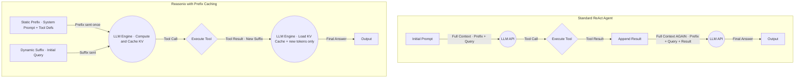

LLM 에이전트를 프로덕션 환경에 배포하려는 시도가 늘어나면서, 아이디어의 실현 가능성만큼이나 '비용'이라는 현실적인 장벽이 중요해졌습니다. 특히 여러 도구를 사용하고 복잡한 추론을 수행하는 ReAct(Reason-Act) 기반 에이전트는 매 단계마다 시스템 프롬프트, 도구 정의, 대화 기록 등 거대한 컨텍스트를 반복적으로 API에 전송합니다. 이는 전체 토큰의 80-90%가 동일한 내용으로 중복 전송되는 비효율을 낳으며, 그대로 비용과 지연 시간(latency) 증가로 이어집니다. 이 문제를 해결하지 못하면 정교한 에이전트는 '데모' 수준을 넘어서기 어렵습니다.

DeepSeek-Reasonix(이하 Reasonix)는 바로 이 문제를 정면으로 겨냥하는 사례로 알려져 있습니다. Reasonix는 DeepSeek 모델 자체가 아니라, **DeepSeek 전용으로 설계된 오픈소스 터미널 코딩 에이전트 프레임워크**입니다(GitHub `esengine/DeepSeek-Reasonix`, TypeScript/Ink TUI). DeepSeek API가 제공하는 **Context Caching(KV 캐시)** 위에서, 에이전트의 입력 접두사(Prefix)를 바이트 단위로 안정적으로 유지하도록 모든 레이어를 설계해 캐시 히트율을 극대화한다는 점이 핵심입니다. 즉 'Prefix Caching'이라는 인프라 기능 자체는 DeepSeek 플랫폼이 제공하고, Reasonix는 그 기능을 100%에 가깝게 활용하도록 에이전트 루프를 정렬한 구현체입니다.

> **출처/검증**: Reasonix는 DeepSeek 공식 문서의 추천 통합으로 소개되어 있으며, 프로젝트 자체 벤치마크에서 단일 사용자가 4.35억 입력 토큰을 처리하며 99.82% 캐시 히트율을 기록(약 $61 → $12, 5x 절감)했다고 보고한다. 또 5턴 멀티턴 시나리오에서 Claude Sonnet 대비 93.9% 비용 절감을 주장한다. 이 수치들은 **프로젝트 측 자체 측정**이므로, 보편적 보장이 아니라 "잘 정렬된 조건에서의 상한선"으로 읽어야 한다.

이 글에서는 Reasonix가 보여준 접근법을 분석하고, 이 개념을 자신의 AI 프로젝트에 어떻게 전이할 수 있을지 살펴봅니다.

## ReAct 에이전트의 비용 구조와 근본적 한계

표준적인 ReAct 에이전트의 작동 방식은 토큰 비효율성을 내재하고 있습니다. 사용자의 요청을 처리하기 위해 에이전트는 '생각(Reason)'하고 '행동(Act)'하는 과정을 반복합니다.

1.  **Reason**: 현재 상황과 목표를 고려하여 다음에 어떤 도구를 사용할지 결정한다.
2.  **Act**: 결정된 도구를 실행하고 그 결과를 관찰(Observation)한다.
3.  **Repeat**: 관찰 결과를 바탕으로 최종 답을 찾거나 다음 행동을 결정하기 위해 1번으로 돌아간다.

문제는 매 반복마다 LLM에 전달되는 컨텍스트의 구조에 있습니다.

`[System Prompt] + [Tool Definitions] + [Chat History] + [Previous (Reason, Act, Observation)] + ...`

여기서 `[System Prompt]`, `[Tool Definitions]`, `[Chat History]` 등은 추론 과정 내내 거의 변하지 않는 'Prefix(접두사)'입니다. 에이전트가 도구를 한 번 호출하고 그 결과를 받아 다음 추론을 이어갈 때, 이 거대한 Prefix가 또다시 전송됩니다. 이는 마치 Swift 앱에서 `viewDidLoad`에 있어야 할 초기 설정 코드를 `viewDidLayoutSubviews`에서 매번 반복 실행하는 것과 같은 비효율입니다.

### Prefix Caching: 단순 캐싱을 넘어서

의미 기반(Semantic) 캐싱은 입력 프롬프트가 의미적으로 유사할 때 이전 *응답*을 재사용하므로, 매 턴 새 추론이 필요한 에이전트에는 히트율이 극히 낮습니다. 반면 KV 기반 Prefix Caching은 LLM 트랜스포머 아키텍처 자체를 활용합니다.

LLM은 토큰을 처리할 때 각 토큰에 대한 Key-Value(KV) 쌍을 계산하여 어텐션(attention) 메커니즘에 사용합니다. 이 KV 쌍은 한 번 계산되면 다음 토큰을 처리할 때 재사용될 수 있습니다. DeepSeek의 Context Caching API는 이 점에 착안해, 직전 요청과 **선두에서부터 동일한 토큰 구간**에 대한 KV 계산 결과를 서버에 캐싱해 둡니다. 다음 요청에서 접두사가 바이트 단위로 같으면, 그 구간은 다시 계산하지 않고 캐시에서 로드한 뒤 새로운 토큰(Suffix)만 계산합니다. 이로써 입력 토큰의 청구 단가가 낮아지고(캐시 히트 토큰은 일반 입력 토큰보다 저렴), 첫 토큰 생성 시간(TTFT, Time to First Token)도 단축됩니다.

여기서 핵심은 **접두사가 단 1바이트라도 바뀌면 그 지점 이후 캐시가 전부 무효화된다**는 점입니다. 그래서 캐시 히트율을 높이는 일은 '접두사를 절대 흔들지 않는 규율'의 문제가 됩니다. Reasonix는 자체 문서에서 99.82% 히트율을 만든 네 가지 설계 원칙을 제시하는데, 모두 이 규율의 변주입니다.

- **ImmutablePrefix**: 시스템 프롬프트와 도구 정의를 세션 시작 시점에 동결해, 매 턴 동일한 바이트 시퀀스로 보낸다. (도구 목록을 매번 재정렬하거나 타임스탬프를 끼워 넣으면 캐시가 깨진다.)
- **AppendOnlyLog**: 대화 로그는 뒤에 추가만 한다. 과거 턴을 재정렬하거나 in-place로 수정하지 않는다.
- **VolatileScratch**: 사고 과정(chain-of-thought) 같은 휘발성 텍스트는 캐싱되는 접두사 *바깥*에 둔다.
- **Auto-compact**: 컨텍스트가 한도에 가까워지면 오래된 턴을 요약 메시지로 접되, 접두사 앞부분은 건드리지 않는다.

이 네 가지를 코드 변경에 비유하면, "캐시를 쓰는 법"이 아니라 "캐시를 깨지 않는 법"에 가깝습니다. iOS에서 `Equatable`/`Hashable` 구현이 흔들리면 `Set`/`Dictionary` 무결성이 깨지듯, 접두사 직렬화가 비결정적이면 캐시는 조용히 미스로 떨어집니다.



이 다이어그램은 두 접근 방식의 차이를 보여줍니다. 표준 에이전트는 매번 전체 컨텍스트를 재전송하지만, Reasonix 류 설계에서는 접두사를 고정해 두 번째 턴부터 서버가 캐시된 KV를 재사용합니다.

참고로 DeepSeek의 Context Caching은 **자동(automatic)** 동작이라 클라이언트가 별도의 캐시 ID를 발급받아 주고받지는 않습니다. 서버가 직전 요청과의 공통 접두사를 자동으로 매칭합니다. 그래서 클라이언트가 할 일은 "ID 관리"가 아니라 "**요청 접두사를 매 턴 동일한 바이트로 직렬화하는 것**" 하나로 수렴합니다. 다른 제공자(예: Anthropic)는 명시적 `cache_control` 마커를 요구하는 등 방식이 다르므로, 적용 전 해당 API의 캐싱 모델을 반드시 확인해야 합니다.

## 캐싱 전략 비교: 언제 Reasonix가 빛을 발하는가

모든 상황에 Prefix Caching이 최적인 것은 아닙니다. 프로젝트의 특성에 따라 적합한 캐싱 전략은 달라질 수 있습니다.

| 전략 | 주요 원리 | 장점 | 단점 | 최적 사용 사례 |
| --- | --- | --- | --- | --- |
| **No Caching** | 모든 요청을 독립적으로 처리 | 구현이 가장 단순함. 상태 관리가 필요 없음. | 비용과 지연 시간이 가장 높음. | 일회성, 비대화형 작업. |
| **Semantic Cache**<br />(e.g., GPTCache) | 입력 프롬프트의 의미적 유사도를 기반으로 이전 응답 반환 | 동일하거나 유사한 질문에 대한 반복 비용 절감. | 캐시 히트율이 낮음. 에이전트의 동적 추론 과정에는 부적합. | FAQ 챗봇, 일반적인 질문 응답. |
| **Reasonix Prefix Cache** | LLM의 KV 캐시를 활용하여 프롬프트의 불변 접두사를 캐싱 | 다단계 추론/도구 사용 에이전트의 비용 및 지연 시간 대폭 감소. | 서버 측 지원이 필수적임. 캐시 관리의 복잡성 증가. | 복잡한 도구 사용 에이전트, 코드 생성/디버깅, 데이터 분석. |

Reasonix의 접근법은 특히 다음과 같은 상황에서 진가를 발휘합니다.
- **긴 시스템 프롬프트와 다수의 도구 정의**: Prefix의 크기가 클수록 절감 효과가 커집니다.
- **여러 번의 도구 호출이 필요한 작업**: 추론의 '턴(turn)'이 길어질수록 중복 전송을 막는 효과가 누적됩니다.
- **정해진 역할 내에서 작동하는 에이전트**: 시스템 프롬프트나 역할이 자주 바뀌지 않는 경우 캐시를 재사용하기 용이합니다.

반면, 매 대화마다 에이전트의 역할이나 사용 가능한 도구가 완전히 바뀌는 동적인 환경에서는 Prefix가 계속 변경되므로 캐싱의 이점이 줄어들 수 있습니다. 이는 오히려 캐시를 생성하고 폐기하는 오버헤드를 유발할 수 있습니다.

### 개념 전이: 내 에이전트에 어떻게 적용하나

Reasonix 자체는 터미널 코딩 에이전트(TypeScript)지만, 그 설계 원칙(접두사 동결 + append-only)은 모델/언어에 무관하게 전이됩니다. 사주 해석 에이전트(`tarosaju` 류)를 가정해 봅시다. 시스템 프롬프트와 도구 정의(만세력 조회 · 오행 분석 · 대운 분석 등)가 매 턴 동일하게 유지되는 전형적인 ReAct 시나리오입니다.

캐시 히트를 얻기 위해 클라이언트가 해야 할 일은 **"메시지 배열을 매 턴 동일한 접두사로 직렬화하고, 변하는 부분만 뒤에 append한다"** 입니다. DeepSeek의 자동 캐싱에서는 별도의 `cacheId` 발급/관리가 없으므로, 아래 의사 코드의 핵심은 ID 관리가 아니라 **메시지 순서를 절대 흔들지 않는 것**입니다.

```swift
// 개념 증명용 의사 코드 — 실제 비용 절감은 백엔드/모델 제공자의
// 자동 prefix caching이 동작할 때 발생한다.

struct ChatMessage { let role: String; let content: String }

final class SajuAgent {
    // 핵심: 이 두 메시지는 세션 동안 절대 바뀌지 않는 "동결된 접두사"다.
    private let frozenPrefix: [ChatMessage]
    // 대화는 오직 append만 한다 (재정렬/수정 금지 → 캐시 무효화 방지).
    private var log: [ChatMessage] = []

    init(sajuInfo: SajuInfo) {
        frozenPrefix = [
            ChatMessage(role: "system", content: "당신은 명리학 전문가입니다..."),
            // 도구 정의를 매번 같은 순서로 직렬화해야 바이트가 동일하다.
            ChatMessage(role: "system", content: "[Tool: getMangseryuk, analyzeOhaeng, analyzeDaeun]"),
            ChatMessage(role: "user", content: sajuInfo.deterministicDescription),
        ]
    }

    func send(_ message: String) async throws -> String {
        log.append(ChatMessage(role: "user", content: message))
        // 전송 = 동결 접두사 + append-only 로그. 접두사는 매 턴 동일 바이트.
        let response = try await apiClient.chat(messages: frozenPrefix + log)

        if let toolCall = response.toolCall {
            let result = executeTool(toolCall)
            log.append(ChatMessage(role: "tool", content: result.deterministicDescription))
            return try await send("도구 결과를 반영해 다음 단계를 진행해줘.")
        }
        log.append(ChatMessage(role: "assistant", content: response.finalAnswer))
        return response.finalAnswer
    }

    private func executeTool(_ toolCall: ToolCall) -> ToolResult { ToolResult() }
}
```

여기서 가장 흔한 실패 모드는 캐시 미스가 **조용히** 발생한다는 점입니다. API는 에러를 던지지 않고 그냥 더 비싼 일반 입력 토큰으로 청구할 뿐이라, 비용 대시보드를 보기 전까지 깨진 줄 모릅니다. 대표적 함정:

- 도구 정의를 `Dictionary` 등 **순서 비보장 컬렉션**으로 직렬화해 턴마다 키 순서가 바뀜.
- 시스템 프롬프트에 현재 시각·요청 ID 같은 **턴마다 변하는 값**을 끼워 넣음.
- JSON 직렬화 시 공백/키 정렬이 비결정적이라 같은 의미인데 바이트가 다름.

그래서 적용 전후로 `ccusage` 같은 도구나 제공자 대시보드에서 **캐시 히트 토큰 비율을 베이스라인으로 측정**하고, 변경 후 다시 측정해 실제 절감을 확인해야 합니다. "90% 절감" 같은 수치는 접두사가 크고 턴이 길며 접두사가 완벽히 고정된 상한 조건의 값이지, 기본값이 아닙니다.

## 자기 점검

### 이해도 질문

1.  기존의 의미 기반 캐시(Semantic Cache)와 Reasonix의 Prefix Caching은 에이전트의 다단계 추론 상황에서 왜 다른 효율을 보이나요?
2.  Prefix Caching 전략의 효과가 감소하거나 오히려 비효율적일 수 있는 시나리오는 무엇일까요?
3.  LLM의 'KV 캐시'가 무엇이며, 이것이 어떻게 Prefix Caching을 기술적으로 가능하게 하는지 설명해 보세요.

### 프로젝트 적용 질문

1.  현재 진행 중인 프로젝트(또는 구상 중인 아이디어)에서 반복적으로 호출되지만 변하지 않는 컨텍스트(Prefix)는 무엇인가요? 이 Prefix를 분리하여 캐싱한다면 비용과 성능에 어느 정도의 영향을 미칠 것으로 예상되나요?