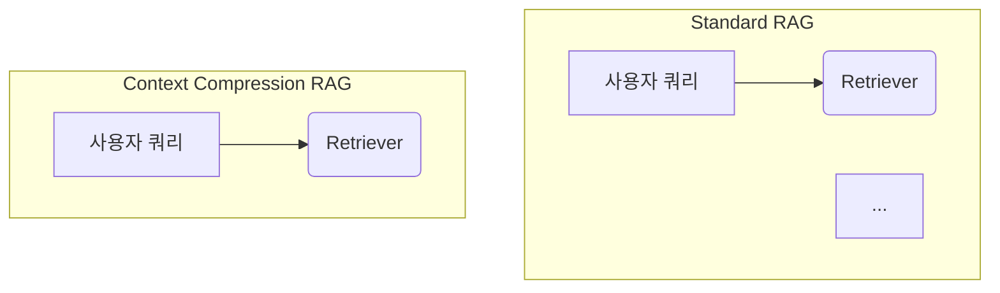

# Mermaid subgraph 이름에 공백이 있으면 `id ["label"]` 형식 필수

## 증상

Gemini가 자동 생성한 `content/context-engineering/context-compression.mdx`에서 `npm run build` 실행 시 validation 에러:

```
❌ content/context-engineering/context-compression.mdx (Mermaid)
   Line ~72: subgraph 형식 오류: "Standard RAG". 유효 형식: "subgraph id", 'subgraph id ["label"]', 'subgraph "name"'
   Line ~80: subgraph 형식 오류: "Context Compression RAG". 유효 형식: "subgraph id", 'subgraph id ["label"]', 'subgraph "name"'
```

빌드가 차단되어 `git push`가 막혔다 (push 직전 rebuild 단계).

## 원인

Mermaid `subgraph` 문법:

```
subgraph <id> [optional "label"]
```

**`<id>`는 공백이 없는 단일 토큰**이어야 한다. `subgraph Standard RAG`은 Mermaid 파서가 `Standard`만 id로 인식하고 `RAG`를 잘못된 토큰으로 처리한다.

셋 중 하나로 적어야 통과:
1. `subgraph myid` — 단일 토큰 id만
2. `subgraph myid ["Display Label"]` — id + 표시 라벨
3. `subgraph "Display Label"` — 따옴표 감싼 이름 전체 (id 없이)

## 해결

### Before



### After


id는 snake_case 단일 토큰, label은 따옴표로 감싸 공백 허용.

## 근본 원인

> "이번이 두 번째 — Gemini가 생성한 Mermaid subgraph에서 공백 이름 이슈는 재발하는 패턴이다."

이전 유사 사례:
- 2026-04-09 `ai-testing-strategies.mdx` — 다른 Mermaid 문법 이슈로 수정
- 2026-04-11 `agent-architectures.mdx` — 같은 날 `<br>` 태그 이슈로 Vercel 배포 실패 (2026-04-09 솔루션과 동일 패턴 재발)

**공통점**: Gemini는 학습 데이터에서 본 "사람이 읽기 좋은" subgraph 이름과 HTML void 태그를 그대로 쓰는 경향이 있음. MDX/Mermaid 문법 제약을 모른다. **같은 날 두 건 발생 = 프롬프트 가드가 없다는 강한 신호.**

### 장기 해결 — 프롬프트 가드 추가

`scripts/generate-lesson.mjs` 프롬프트에 Mermaid 문법 제약을 명시해야 반복을 방지할 수 있음:

```
Mermaid 다이어그램 작성 규칙:
- subgraph 이름에 공백이 있으면 반드시 `subgraph id ["Label Name"]` 형식 사용
- 예: subgraph rag_standard ["Standard RAG"]
- 노드 라벨의 공백/특수문자는 [...] 또는 ("...") 안에서만 사용
```

(이번 스프린트에서는 수정만 하고 프롬프트 가드는 백로그로 넘김 — TODOS.md 참조)

## 사전 검증이 있었기에 살았다

`scripts/validate-content.mjs`의 Mermaid 검증이 **push 전에** 이 에러를 잡아줬다. 만약 검증이 없었다면:
- 빌드는 통과 (Next.js 입장에선 MDX 파일 하나의 mermaid 코드 블록일 뿐)
- 실제 페이지 렌더링 시 Mermaid 클라이언트가 에러 → 사용자에게 빈 다이어그램 노출

검증 스크립트 자체가 compound 자산의 예시.

## 체크리스트

Mermaid 다이어그램 작성 시:

- [ ] subgraph 이름에 공백이 있으면 `id ["Label"]` 형식 사용
- [ ] 노드 라벨은 `[...]` 또는 `("...")` 안에서만 공백·특수문자 사용
- [ ] 로컬에서 `npm run build` 또는 `node scripts/validate-content.mjs`로 사전 검증
- [ ] AI 생성 콘텐츠는 mermaid 코드 블록을 꼼꼼히 리뷰

## 관련 파일

- `scripts/validate-content.mjs` — Mermaid 사전 검증
- `content/context-engineering/context-compression.mdx` — 이번 수정 대상
- `content/harness-engineering/ai-testing-strategies.mdx` — 과거 유사 사례
