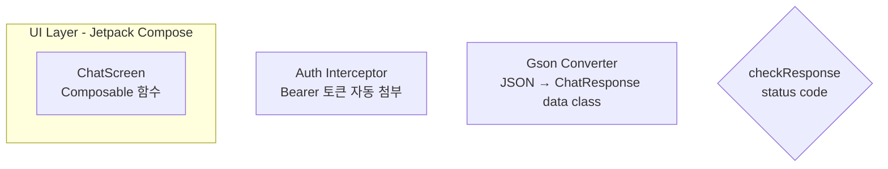

# Mermaid 노드 label의 `<br/>` + 특수문자는 따옴표 필수

## 증상

`/wiki/android-ai/android-flow-map-via-aidy-android` 페이지에서 첫 flowchart 다이어그램이 **"Mermaid 에러"** 메시지와 함께 원본 코드가 그대로 표시됨. 빌드는 통과했고 `validate-content.mjs`도 경고 없음.

```
Mermaid 에러

flowchart TD
    User[사용자: TextField에 입력 + 전송 버튼 탭]
    subgraph UI ["UI Layer - Jetpack Compose"]
      Screen[ChatScreen<br/>Composable 함수]
      ...
```

## 원인

Mermaid 파서는 노드 label 안에 `<br/>`, `→`, `/`, `+` 같은 특수문자가 들어갈 때 **label을 따옴표로 감싸야** 파싱한다. 대괄호 안에 바로 쓰면 syntax error.

```
❌ Screen[ChatScreen<br/>Composable 함수]
❌ Api[AidyApiService<br/>Retrofit 인터페이스]
❌ Server[aidy-server<br/>POST /api/chat]
❌ GSON[Gson Converter<br/>JSON → ChatResponse]
❌ Check{checkResponse<br/>status code}  # rhombus도 동일

✅ Screen["ChatScreen<br/>Composable 함수"]
✅ Api["AidyApiService<br/>Retrofit 인터페이스"]
✅ Server["aidy-server<br/>POST /api/chat"]
✅ GSON["Gson Converter<br/>JSON → ChatResponse"]
✅ Check{"checkResponse<br/>status code"}
```

### 왜 validate-content.mjs 가 놓쳤나

`scripts/lib/mermaid-fix.mjs`는 **괄호 `()` 가 label에 있을 때만** 자동 따옴표를 붙인다:

```js
fixed = fixed.replace(
  /([A-Z]\d*)\[(?!")([^\[\]"]*\([^\[\]"]*\)[^\[\]"]*)\]/g,
  '$1["$2"]',
);
```

`<br/>` · `→` · `/` 패턴은 이 정규식 범위 밖. 빌드 타임 mermaid 컴파일러가 없기 때문에 (Next.js는 mermaid를 code block string 그대로 통과시키고 클라이언트에서 렌더) **런타임 전까지 에러가 드러나지 않는다.**

## 해결

### Before



### After


### 일괄 수정 one-liner

MDX 파일 여러 개에 동일 패턴이 있을 때:

```bash
node -e '
const fs = require("fs");
const files = ["content/path1.mdx", "content/path2.mdx"];
for (const f of files) {
  const raw = fs.readFileSync(f, "utf8");
  const out = raw.replace(/```mermaid\n([\s\S]*?)\n```/g, (match, body) => {
    let fixed = body;
    fixed = fixed.replace(/([A-Za-z_][\w]*)\[(?!")([^\]"]*<br\/>[^\]"]*)\]/g, "$1[\"$2\"]");
    fixed = fixed.replace(/([A-Za-z_][\w]*)\{(?!")([^}"]*<br\/>[^}"]*)\}/g, "$1{\"$2\"}");
    return "```mermaid\n" + fixed + "\n```";
  });
  if (out !== raw) fs.writeFileSync(f, out);
}
'
```

주의: 이 스크립트는 `<br/>` 포함 label만 잡는다. 다른 특수문자(→, · 등)만 있고 `<br/>`이 없는 경우는 별도 수정 필요.

## 근본 원인 — 3번째 재발

이번이 Mermaid 문법 버그 **세 번째**:
1. 2026-04-09 — `<br>` self-closing 없어 MDX 컴파일 에러
2. 2026-04-11 — subgraph 이름 공백
3. 2026-04-16 — 이 건: 노드 label에 `<br/>` + 특수문자 따옴표 누락

**2026-04-16 이전 fix 커밋 ed34d26**은 subgraph 문법과 노드 괄호만 잡고 이 패턴은 놓쳤다 — "일부만 수정" 이 문제 재발의 신호.

### 장기 해결 — validate-content 확장 후보

현재 `mermaid-fix.mjs`의 auto-fix 정규식을 `<br/>` · `→` · `/` · `+` 가 label 안에 있으면서 따옴표가 없는 케이스로 확장:

```js
// 후보 (미적용, 큐에 있음)
fixed = fixed.replace(
  /([A-Za-z_][\w]*)([\[{])(?!")([^\]}"]*(<br\/>|→|[/+])[^\]}"]*)([\]}])/g,
  '$1$2"$3"$5',
);
```

단, `mermaid-fix.mjs` 주석의 **idempotency 경고**를 지켜야 함 — 이미 따옴표 있는 라벨에 중복 따옴표 붙이면 매 실행마다 손상 누적.

## 사전 탐지 방법

```bash
# 커밋 전 grep (MDX 기반 Flow Map 작성 후 습관화)
grep -nE '\[[^"][^]]*(<br/>|→)' content/path/to/file.mdx
grep -nE '\{[^"][^}]*(<br/>|→)' content/path/to/file.mdx
```

매칭되면 해당 라인을 수동 따옴표 처리.

## 체크리스트

- [ ] Mermaid 노드 label에 `<br/>` 이 있으면 `["label<br/>..."]` 형식 (대괄호 · 중괄호 모두)
- [ ] Mermaid 노드 label에 `→`, `/`, `+` 같은 특수문자가 있으면 따옴표 감쌈
- [ ] `rhombus` `{label}` 도 같은 규칙 적용 (`{"label<br/>..."}`)
- [ ] Flow Map 같이 mermaid 한 블록에 20+ 노드가 있을 때는 이 규칙을 **일괄 적용**: 다중 노드가 같은 실수 패턴 공유함
- [ ] 기존 fix PR이 "subgraph만 수정"으로 멈추면 재발 신호 — 노드 label도 훑었는지 확인
- [ ] 빌드 통과만으로 안심하지 말고 **실제 URL을 브라우저에서 열어 렌더 확인** (mermaid는 클라이언트 렌더라 런타임까지 에러 안 뜸)

## 관련 파일

- `scripts/lib/mermaid-fix.mjs` — 현재는 괄호만 자동 따옴표. `<br/>` 미지원
- `scripts/__tests__/mermaid-fix.test.mjs` — 회귀 테스트 (이 패턴 추가 후보)
- `content/android-ai/android-flow-map-via-aidy-android.mdx` · `ios-flow-map-via-aidy-ios.mdx` · `backend-ai/backend-flow-map-via-aidy-server.mdx` — 이번 수정 대상 (27 노드)
- 이전 솔루션: `2026-04-09-br-tag-compile-error.md`, `2026-04-11-mermaid-subgraph-space-in-name.md`
