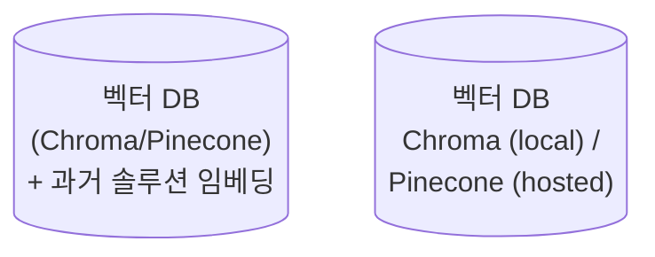
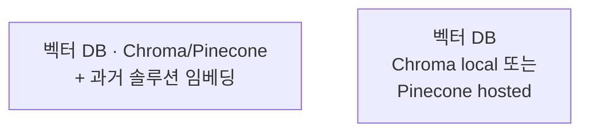

# Mermaid cylinder 노드 `[("...")]` 안의 괄호는 validator 혼란 + 렌더 위험

## 증상

`content/context-engineering/context-scaling-3-layer-architecture.mdx` 에서 `npm run build` 실행 시 validation 에러:

```
❌ content/context-engineering/context-scaling-3-layer-architecture.mdx (Mermaid)
   Line ~68: 노드 라벨에 괄호 사용: "(\"벡터 DB<br/>(Chroma/Pinecone)<br/>+ ...\")".
             수정: ["(\"벡터 DB<br/>(Chroma/Pinecone)<br/>+ ...\")"]
   Line ~198: 노드 라벨에 괄호 사용: "(\"벡터 DB<br/>Chroma (local) /<br/>Pinecone (hosted)\")"
```

Mermaid cylinder 문법 `VDB[("label")]` 은 DB 아이콘 노드를 만들어 깔끔하지만, **label 안에 추가 `()` 를 넣으면** validator 가 "노드 라벨에 괄호 사용" 으로 오탐 + 실제 Mermaid 파서도 괄호 중첩을 모호하게 해석할 위험.

## 원인

Mermaid 의 cylinder 노드 문법:
```
NodeId[("label")]
```

구조: `[(` 시작 + `label` + `)]` 종료. Label 안에 또 `(...)` 가 나오면 파서 입장에서 "cylinder 종료" 와 "label 일부" 가 구분 모호.

게다가 `scripts/lib/mermaid-fix.mjs` 의 auto-fix 정규식은 **일반 대괄호 노드** `[label]` 에 괄호가 있으면 따옴표 처리하는 로직이라, cylinder syntax 에는 부적절하게 트리거됨:

```js
fixed = fixed.replace(
  /([A-Z]\d*)\[(?!")([^\[\]"]*\([^\[\]"]*\)[^\[\]"]*)\]/g,
  '$1["$2"]',
);
```

이 정규식이 cylinder `[("...")]` 의 내부 패턴에도 부분 매칭되면서 "괄호 있음" 경고 발생.

## 해결

### Before (cylinder 내 괄호 중첩)


### After (일반 노드 · 괄호 제거)


- 대괄호 `[...]` 로 일반 노드 (사각형) 사용
- 괄호 `()` 제거 · 부가 설명은 `·` (middle dot) · `또는` 자연어로
- DB 아이콘 시각적 구분이 꼭 필요하면 별도 subgraph `["DB 저장소"]` 로 그룹화

### 참고: cylinder 를 유지하면서 쓰려면

label 안에 괄호가 없으면 cylinder 도 문제없음:
```mermaid
VDB[("벡터 DB · Chroma 로컬")]
```

즉 "cylinder 자체가 금지" 가 아니라 "cylinder label 안에 `()` 중첩 금지".

## 근본 원인 — Mermaid 4번째 재발 패턴

Mermaid 문법 버그 누적:
1. 2026-04-09 — `<br>` self-closing 없어 MDX 컴파일 실패
2. 2026-04-11 — subgraph 이름 공백 → `id ["label"]` 필수
3. 2026-04-16 — 노드 label 에 `<br/>` + 특수문자 따옴표 누락 (런타임-only)
4. **2026-04-16 — cylinder 노드 label 에 `()` 중첩 → validator 오탐 + 파서 모호 (이 건)**

### 공통 패턴

Mermaid "생긴 대로 쓰면 됨" 직관이 MDX + validator + 실제 파서 3중 레이어에서 깨지는 지점. Mermaid 공식 문법은 허용하지만 *이 프로젝트의 validator* 가 엄격하거나, MDX preprocessor 가 간섭하거나.

→ **결론**: 예쁜 shape(cylinder · rhombus 등) 에 욕심 내기 전에 *가장 단순한 `[label]`* 에 quoted string 으로 시작. shape 는 **label 에 특수문자 없을 때만** 추가.

## 사전 탐지 방법

```bash
# mermaid 블록 내 cylinder + 내부 괄호 패턴
grep -nE '\[\("[^"]*\([^"]*\)' content/path/to/file.mdx

# 모든 shape syntax 점검
grep -nE '\[\(|\{\(|\(\(' content/path/to/file.mdx  # cylinder, rhombus, circle
```

매칭 결과 중 label 안에 `()` 가 들어간 것만 골라 수정.

## 체크리스트

Mermaid 다이어그램 작성 시:

- [ ] Cylinder 노드 `[("label")]` 의 label 안에 `(...)` 중첩 금지
- [ ] Rhombus `{label}` 도 내부 `()` 피하기 (또는 `{"..."}` quoted)
- [ ] 다중 설명이 필요하면 `·` · `또는` · `,` 같은 자연어 구분자로
- [ ] shape 에 욕심 내기 전에 `[label]` 기본 + quoted string 으로 검증 통과 먼저
- [ ] `mermaid-fix.mjs` 정규식이 cylinder/rhombus 에 부적절하게 매칭하는 케이스 주의 (2026-04-16 현재)

## mermaid-fix.mjs 확장 후보 (메모)

현재 auto-fix 는 일반 대괄호 노드의 괄호만 처리. cylinder · rhombus · 기타 shape 에 대한 별도 규칙 필요:

```js
// 후보 — 아직 미적용
// cylinder 노드: 내부 괄호가 있으면 shape 를 일반 노드로 다운그레이드 제안
const cylinderWithParens = /([A-Za-z_]\w*)\[\("([^"]*\([^"]*\)[^"]*)"\)\]/g;
// → 경고 또는 자동 변환: $1["$2"]
```

단, memory rule "자동 수정 도구는 자기 검증 없이 신뢰 X" 를 지키려면:
- negative lookahead 로 이미 변환된 라벨 재매칭 차단
- idempotency 테스트 (`scripts/__tests__/mermaid-fix.test.mjs`) 에 새 케이스 추가 필수

## 관련 파일

- `scripts/lib/mermaid-fix.mjs` — auto-fix 정규식 (현재 cylinder 미지원)
- `scripts/__tests__/mermaid-fix.test.mjs` — 회귀 테스트
- `content/context-engineering/context-scaling-3-layer-architecture.mdx` — 이번 수정 대상 (2 cylinder → 일반 노드)
- 이전 솔루션: `2026-04-09-br-tag-compile-error.md`, `2026-04-11-mermaid-subgraph-space-in-name.md`, `2026-04-16-mermaid-br-in-unquoted-node-labels.md`
